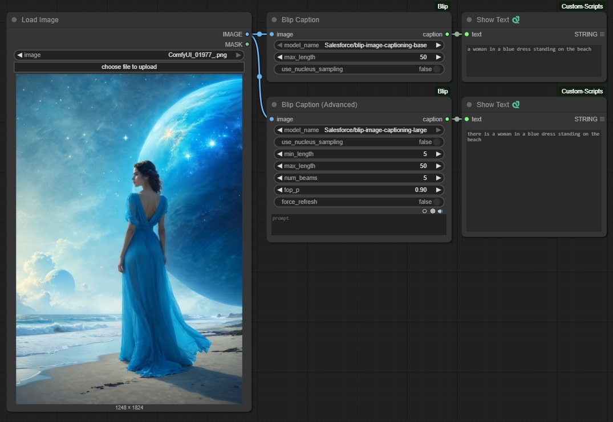

# ComfyUI-Blip

A lightweight and high-speed ComfyUI custom node for generating image captions using BLIP models. Optimized for both GPU and CPU environments to deliver fast and efficient caption generation.



## Features

- Generate captions for images using BLIP models
- Support for both base and large BLIP models
- Simple and advanced captioning options
- Automatic model downloading and caching
- High performance on both GPU and CPU

## Installation

1. Navigate to your ComfyUI custom nodes directory:
```bash
cd ComfyUI/custom_nodes/
```

2. Clone this repository:
```bash
git clone https://github.com/1038lab/ComfyUI-Blip.git
```

3. Install required dependencies:
```bash
pip install -r requirements.txt
```

### Manual Model Download

If automatic download fails, you can manually download the models:

1. Base model:
```
https://huggingface.co/Salesforce/blip-image-captioning-base/resolve/main
```

2. Large model:
```
https://huggingface.co/Salesforce/blip-image-captioning-large/resolve/main
```

Download the following files and place them in the corresponding directories:
- `pytorch_model.bin`
- `config.json`
- `preprocessor_config.json`
- `special_tokens_map.json`
- `tokenizer_config.json`
- `tokenizer.json`
- `vocab.txt`

## Usage in ComfyUI

### Basic Node

1. Add the "Blip Caption" node to your workflow
2. Connect an image input to the node
3. Configure the following parameters:
   - `model_name`: Choose between base (faster) or large (more detailed) BLIP model
   - `max_length`: Maximum length of the generated caption (1-100)
   - `use_nucleus_sampling`: Enable for more creative captions

### Advanced Node

1. Add the "Blip Caption (Advanced)" node to your workflow
2. Connect an image input to the node
3. Configure the following parameters:
   - All basic node parameters
   - `min_length`: Minimum caption length
   - `num_beams`: Number of beams for beam search
   - `top_p`: Top-p value for nucleus sampling
   - `force_refresh`: Force reload model from disk


## License

This repository's code is released under the GPL-3.0 License. - see the [LICENSE](LICENSE) file for details.

## Acknowledgments

- [BLIP](https://github.com/salesforce/BLIP) - The original BLIP model
- [ComfyUI](https://github.com/comfyanonymous/ComfyUI) - The base framework 
